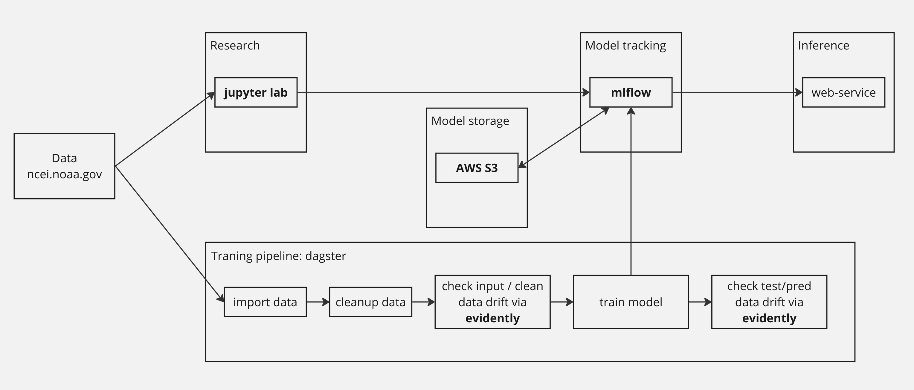

# Barcelona drought prediction
## Project goal
Barcelona was struggling with water supplies lately. The idea of the project is to use some historical data to train model that can predict humidity levels.

## Data
US based [National Centers for Environmental Information](https://www.ncei.noaa.gov/) collects and shares meteorological data from all over the world.

You can search the data using their web tools: https://www.ncei.noaa.gov/access/search/data-search/daily-summaries?stations=SP000008181
For this project I'm using Barcelona Airport data.

## Tools and architecture overview



MLflow is a central pillar of the project. It is being use both for experiments tracking and as a model registry.

Each run of training pipeline tracks metrics and saves model (AWS S3). 
You can register model with MLflow UI.
Latest promoted model then will be used in web-service.

Github actions are being used to run end-to-end test on each commit.

## Local sandbox
There is fully functional sandbox for local development. 

Prerequisites:
 - docker
 - docker-compose
 - python 3.10+
 - poetry

Running sandbox (all command should be run fron project root):
1. If you are planning to make any changes to the code - consider using pre-commit hooks:
```shell
pip install pre-commit
pre-commit install
```
2. Install latest version of poetry
```shell
pip install poetry
```
3. Install dependencies and activate poetry env:
```shell
poetry install
poetry shell
```
4. Run MLflow and localstack:
```shell
./scripts/run-sandbox.sh 
```
5. At this point everything is ready. MLflow UI is available at http://localhost:5000/

## Running jupyter lab
```shell
jupyter-lab
```
`notebooks/model.ipynb` is a notebook with data and model exploration.

## Running training pipeline
All the training pipeline is handled by dagster. To run it:
```shell
dagster job execute -f src/pipelines/jobs.py -j train_linear_model
```
You can check MLFlow UI then - all metrics and artifacts are stored there.

## Running inference web-service
You should register model first. There is two ways to do so
1. Access MLFlow UI: http://localhost:5000/, navigate to `weather-prediction-exp`, choose the run you like
and click `Register model`. Default model name the service will look for is `drought-prediction`
The service will fail to start if there is no model with desired name.

2. Use helper script from the tests to register model:
```shell
env DP_MLFLOW_MODEL_NAME=drought-prediction python tests/utils/register_latest_model.py 
```

Everything is ready to run web-service:
```shell
./scripts/run-sandbox.sh --with-service
```

You can use curl to send API request now:
```shell
curl -X POST http://127.0.0.1:8000/predict -H "Content-Type: application/json" -d '{"lag_365": [0, 1000]}'
```

You can check service logs usinf docker logs: `docker logs docker-prediction-service-1`

## Configuration via env variables
There is some env variables that are being used to configure general parameters:  
`DP_MLFLOW_URL` - mlflow address. Can be used to point deployed web-service to desired MLFlow instance.  
`DP_MLFLOW_MODEL_NAME` - model name that will be registers by `register_latest_model.py`  
and the name web-service will be looking for.  
`DP_DATA_PATH` - source data location. By default points to Barcelona airport data:
https://www.ncei.noaa.gov/data/daily-summaries/access/SP000008181.csv  
